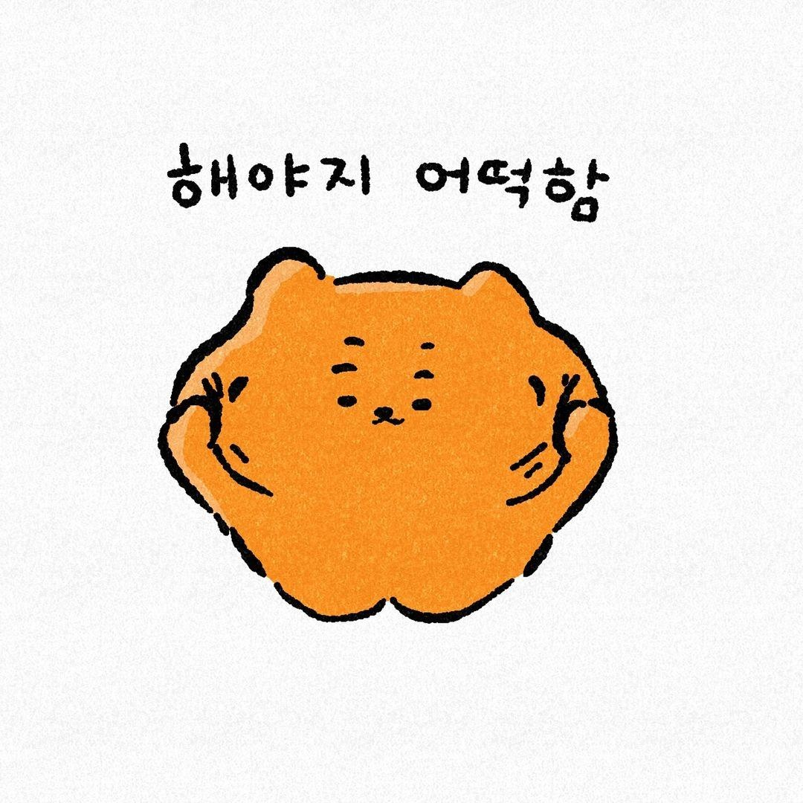

<!-- ### 👋 반갑습니다!
- AI 언어지능을 연구하고 있습니다.
- 머신러닝 시스템 디자인, 서비스 디자인에도 관심을 두고 있습니다.  
- AI 기술을 통해 소소하게 일상을 바꾸는 여러가지 흥미로운 프로젝트들을 개인적으로 기획하고 있습니다. 
- ***"AI to Everywhere, for Everyone"*** 을 추구하기 위해 ***HCI, Design, UX***에도 소소하게 관심을 두고 있습니다.
--> 

### 👋 Eunchan Lee
- I research AI Language Intelligence.
- My interests also include Machine Learning Systems Design and Service Design.
- I enjoy initiating various intriguing personal projects that subtly enhance everyday life through AI.
- Driven by the vision "AI to Everywhere, for Everyone," I have additional interests in HCI, Design, and UX.

**🌱 Research interests**

- Interactive AI
- Natural Language Processing (e.g. Book summarization, Lyrics translation)
- Large Language Models
- Prompt Engineering
- No-Code Tools ***(e.g. Bubble.io, Make.com, n8n, Zapier)***

**🥳 Hobbies**

- Sing and listen band music
- Reading books

**🤗 Huggingface** 

Check out my demos on huggingface [purang2](https://huggingface.co/UNIST-Eunchan)

<!--
**📚 Technical Blog**

-->

<!--
**👨‍💻 Career & Experiences**

<a href="https://github.com/qiskit-community/quantum-hackathon-korea-21?tab=readme-ov-file" >    

-->
<!--

### 👋 Hello! 
I'm researching AI language intelligence at ***UNIST***!  
I'm also interested in machine learning system design and service design.  
I am personally working on a number of interesting projects that use AI technology to change our daily lives in small ways. 😄  
I also have minor interests in ***HCI, Design, UX*** to pursue ***"AI to Everywhere, for Everyone"***.

**👋(반갑습니다!)** ***UNIST***에서 AI 언어지능을 연구하고 있습니다.   
머신러닝 시스템 디자인, 서비스 디자인에도 관심을 두고 있습니다.  
AI 기술을 통해 소소하게 일상을 바꾸는 여러가지 흥미로운 프로젝트들을 개인적으로 기획하고 있습니다. 😄  
***"AI to Everywhere, for Everyone"*** 을 추구하기 위해 ***HCI, Design, UX***에도 소소하게 관심을 두고 있습니다.

-->
<!---->

<!--
--- 

**GitHub Profile Summary Cards**

  

-->

<!--

-->

<!--
 
<h3 align='center'>📑🕵️‍♂️ Publications </h3>

   |  Date   |               Name               |  Journal or Conference   |               Keywords              |                                               Authors                                                |
| :-----: | :------------------------------: | :----------: | :------------------------------: | :-----------------------------------------------------------------------------------------------: |
| Nov. 2022 | Story to Art Generation using Finetuned Stable Diffusion | ***Korean Artificial Intelligence Associaion (KAIA 2022, Autumn), Domestic Conference*** | ***Text-to-Image Synthesis, Multi-modal, NLP, GPT*** | ***[Seunghoon Lee](https://github.com/16SeungHun), [Dongyeop Lee](https://github.com/edong6768), [Eunchan Lee (Me)](https://github.com/purang2)***|
| Oct. 2022 | Image Generation from Korean Dialogue Text via Prompt-based Few-shot Learning | ***The 34th Annual Conference on Human & Cognitive Language Technology(HCLT 2022), Domestic Conference*** | ***NLP, Text Generation, Text Sytle Transfer, Text&Image Multi-modal AI***| ***[Eunchan Lee (Me)](https://github.com/purang2), [Sangtae Ahn](https://scholar.google.co.kr/citations?user=F-LXQwcAAAAJ&hl=ko)*** |
| Oct. 2022 | Improving Performance of Sentiment Classification using Korean Style Transfer based Data Augmentation  | ***The 34th Annual Conference on Human & Cognitive Language Technology(HCLT 2022), Domestic Conference*** | ***NLP, Text Sytle Transfer, Data Augmentation, BART***| ***[Eunwoo Go](https://github.com/eun-woo),[Eunchan Lee (Me)](https://github.com/purang2), [Sangtae Ahn](https://scholar.google.co.kr/citations?user=F-LXQwcAAAAJ&hl=ko)*** |
| Oct. 2022 | Generating Literature-Style Sentences based on Summarized Text | ***The 34th Annual Conference on Human & Cognitive Language Technology(HCLT 2022), Domestic Conference*** | ***NLP, Text Generation, Text Sytle Transfer, BART***| ***[Bugwang Choe](https://github.com/mecuryD),[Eunchan Lee (Me)](https://github.com/purang2), [Sangtae Ahn](https://scholar.google.co.kr/citations?user=F-LXQwcAAAAJ&hl=ko)*** |
| Aug. 2022 | Prompt-based In-Context Learning for Korean Question Answering | ***Korean Artificial Intelligence Associaion (KAIA 2022, Summer), Domestic Conference*** | ***NLP, Question Answering, Few-shot Learning, In-context Learning*** | ***[Eunchan Lee (Me)](https://scholar.google.com/citations?user=stfV6M8AAAAJ&hl=ko),[Sangtae Ahn](https://scholar.google.co.kr/citations?user=F-LXQwcAAAAJ&hl=ko)***|
| Apr. 2022 | [Comparative Study of Multiclass Text Classification in Research Proposals Using Pretrained Language Models](https://www.mdpi.com/2076-3417/12/9/4522) | ***International Journal, Applied Sciences (💎SCIE, IF=2.838)*** | ***NLP, BERT, Multi Class Text Classification*** | ***[Eunchan Lee (Me)](https://scholar.google.com/citations?user=stfV6M8AAAAJ&hl=ko), [Changhyeon Lee](https://github.com/2changhyeon), [Sangtae Ahn](https://scholar.google.co.kr/citations?user=F-LXQwcAAAAJ&hl=ko)***|
 

 
<h3 align='center'>🏆👨‍🔬 Awards & AI Competitions </h3>

|  Date   |               Name               |  Organizer   |               Related Task               |                                               Rank                                                |
| :-----: | :------------------------------: | :----------: | :------------------------------: | :-----------------------------------------------------------------------------------------------: |
| Nov. 2022 | [The 4th Korean Emotion Recognition International Challenge, 2022](https://github.com/purang2/KERC-Challenge) | Chonnam National University | NLP, K-Drama Dialogue Analysis, Sentiment Analysis | 6 / 106 ***(🥉Awarded, Bronze Prize)*** |
| Oct. 2022 | [SKT AI Fellowship, Multi-modal AI Tech Research](https://devocean.sk.com/blog/writer/index.do?ID=&boardType=&searchData=sam56903&page=&subIndex=%EC%B5%9C%EC%8B%A0+%EA%B8%B0%EC%88%A0+%EB%B8%94%EB%A1%9C%EA%B7%B8) | SK Telecom | Image-Text Multimodal AI, Text-to-Image | ***(🥉Awarded, Encouraged Prize)***
| May. 2022 | [Code Similarity Detection AI Competition](https://dacon.io/competitions/official/235900/overview/description) | Dacon | NLP, Code Similarity | 27 / 337 **(Top 8%)** |
| Jan. 2022 | [Korean Sentence Pair Classification AI Competition](https://dacon.io/competitions/official/235875/overview/description) | Dacon | NLP, Natural Language Inference | 62 / 468 **(Top 12%)** |
| Aug. 2021 | [Natural Language-based Climate Technology Information Classification AI Competition](https://dacon.io/competitions/official/235744/overview/description) | Dacon | NLP, Multi Class Text Classification | 71 / 258 **(Top 28%)** |
| Feb. 2021 | [Qiskit Hackathon Korea 2021](https://github.com/yh08037/quantum-neural-network) | IBM, Qiskit | Quantum Computing, Quantum Neural Network | ***(🏆Awarded, Community Choice Award)*** |
| Nov. 2020 | Daegu&Gyeongbuk AI Programming Competition 2020 | Kyungpook National University | Machine Learning, Regression | ***(🥉Awarded, Encouraged Prize)***
 
-->

<!--
**👨‍💻 Career & Experiences**

<a href="https://github.com/qiskit-community/quantum-hackathon-korea-21?tab=readme-ov-file" >    

-->

<!--
**GitHub Profile Summary Cards**
  

-->
<!--
**👨‍💻 Career & Experience**

-->

<!--### 👋 ***[※ new update🤱]*** 

These days, I've been trying to channel my surplus energy into something more productive,

and as one of them, I'm working on a new project (website) for myself, so stay tuned for more details and please take a look at it~🙂!

**⬇ Wiki about Me⬇**
> ***https://purang2.oopy.io/***

And also, this is 

**⬇ Blog I'm running⬇**
> ***https://james-eunchan.tistory.com/***

### please visit~!🙂
-->

<!-- ### About Me 🌱
- I'm a first-year PhD student at UNIST Language & Intelligence Lab. 
- I'm studying natural language processing (NLP), language AI.
- 😁Please check my portfolio here: https://supurang.github.io/portfolio/

### I'm interested in

  

### More Information

-->
<!--
### Hello! I'm Eunchan Lee 👋

- 🧐 I'm currently working **[@Language & Intelligence Lab](https://sites.google.com/view/language-intelligence-lab) in UNIST**.
- 🌱 I'm interested in *****Natural Language Processing (NLP)*****
  - ***Representation learning for document-level tasks and long text sequences***
    - Book or paper summarization, story generation, extending new tasks.
  - ***Prompting and in-context learning with (large) language models***.

- **🟩More information about me**
  - ***B.S.& M.S. at Kyungpook National University, School of Electronic Engineering (KNUSEE)*** 
  - ***Ph.D Course at Ulsan National Institute of Science and Technology, AI Graduate School (UNIST AIGS)***
  - ***AI&NLP Researcher at SK Telecom (SKT AI Fellowship / 4th, 2022)***
- ***CV: [[Click here]](https://github.com/purang2/purang2/blob/main/cv%20(8).pdf)***

<!--

-->
  
<!--Hi I'm **Eunchan Lee, an AI / NLP Research Student**-->

<!--
### More Information

-->

<!--
### I'm interested in
 

  
  
### 👨‍💻 Career & Experience

**🎼Personelly I Like..**

 

    <h3>
        GitHub Profile Summary Cards
    </h3>

  

-->
